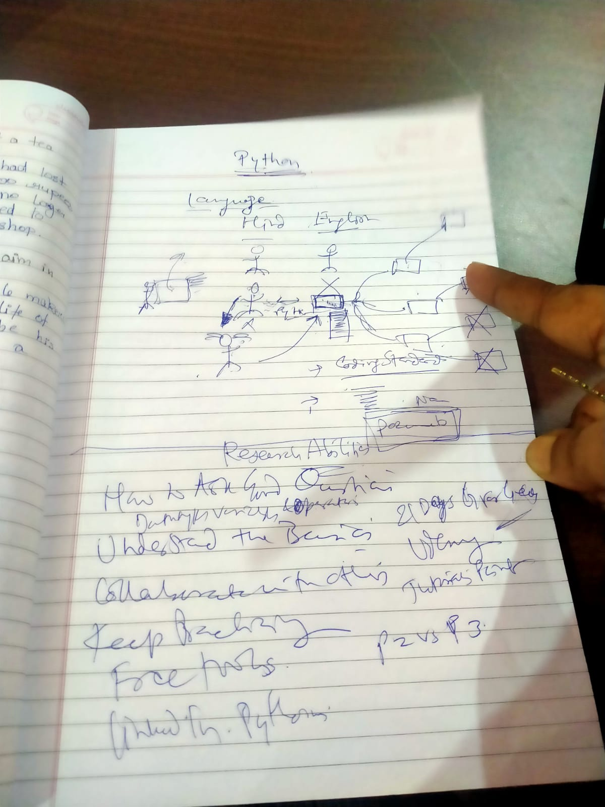
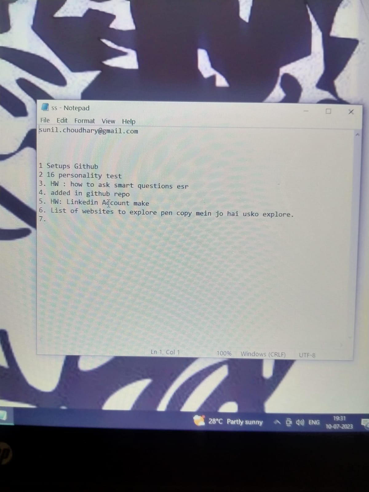

Remarks :  First day teething troubles. amit joined late
We discussed 
1. the possibiliity of using TV and HDMI cable 
2. Various Python courses available on net and otherwise. 
# myPython
Teaching 

Available Options 

- https://medium.com/javarevisited/10-free-python-tutorials-and-courses-from-google-microsoft-and-coursera-for-beginners-96b9ad20b4e6
- https://hackr.io/blog/best-way-to-learn-python
- https://www.datacamp.com/blog/python-2-vs-3-everything-you-need-to-know
- Documentation https://docs.python.org/3/

- [[https://github.com/suchoudh/myPython/blob/main/Day1/4.jpeg]g

One 

Two 

Three 

Four 

# 

